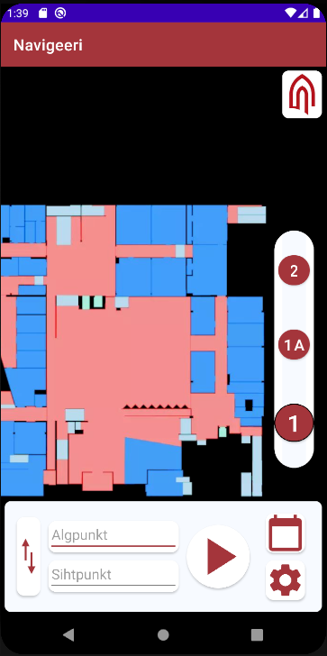

## Appi, olen eksinud!

Tallinna Ülikooli hoone on piisavalt suur, et seal ära eksida. Tallinna Ülikooli õpetaja, õpilane või külaline kasutab telefoni appi, et orienteeruda koolimaja peal. 
Sisestatakse algus ja lõpp-punkt ning telefoni rakendus näitab teekonda. 
Projekt on loodud Tallinna Ülikooli esimese aasta tudengite poolt aine tarkvaraarenduse projekt raames.

### Kasutatud tehnoloogiad:

- Android Studio 4.2.1,
- DB Browser for SQLite Version 3.12.2,
- Adobe Illustrator CS6 16.0.0,
- Google Spreadsheets,
- GitHub Desktop Version 2.9.0 (x64),
- Mapbox Android SDK 9.6.1,

### Osalejad:

Projektis osalesid Egle Vestrik, Andres Pihl, Anastasija Selevjorstova ja Daniel Janson. Täname Carolyn Kokka tema varasemate panuste eest. 

### Paigaldus:

Nõuded
- Android 7.0 + 
- Internetti ühendus
- navigatsiooni ettekujutusvõime 

1. Lae alla see absoluutselt mitte kahtlane rakendus [Appi Olen Eksinud.zip](https://github.com/DanielAugustJanson/TLU2/files/6669392/Appi.Olen.Eksinud.zip).
2. Ava endale mugavas Zip faili rakenduses 
3. Tee lahti ja paigalda 
4. Pane tööle 

